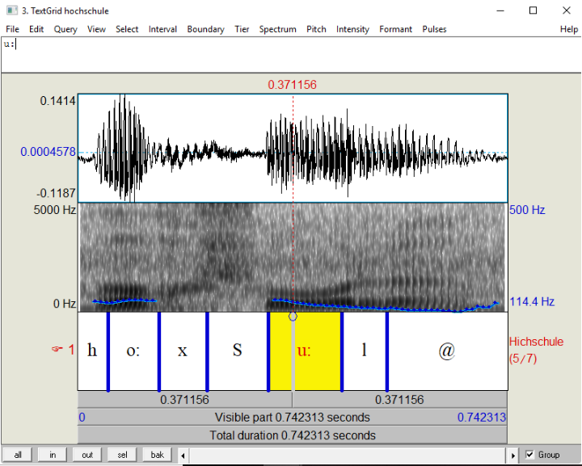

###  Ubung 1

## Teil 1: Das Wavesignal
Das gewählte Wort : hochschule

Die SAMPA-Notation von "Hochschule" : ho:xSu:l@

[hochschule.wav](https://vocaroo.com/i/s1WPZiTJOgE5)

## Teil 2 : Analyse des Wortes

