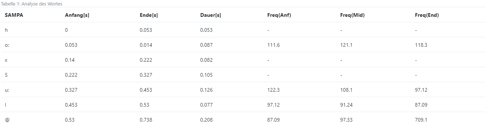

### 
Ubung 2

##  
Das Wavesignal

Das gewählte Wort : hochschule

Die SAMPA-Notation von "Hochschule" : ho:xSu:l@

[hochschule.wav](https://vocaroo.com/i/s1WPZiTJOgE5)

## 
Analyse des Wortes

##  
MBROLI
 

[hochschule_Mboli.wav](https://vocaroo.com/i/s1CptpcvBUj2)

##  
“Hochschule” Wort mit MBROLI synthetisieren:

[hochschule_synthese.wav](https://vocaroo.com/i/s1o51lwmUSQG)

##  
Analyse Satz “herzlich willkommen”

[herzlichwillkomen.wav](https://vocaroo.com/i/s0IP3fKjfsuV)

# "herzlich willkommen" mit MBROLI synthetisieren

#### Wie unterscheidet sich die Synthese-Wellenform vom Original? Wie klingt die Synthese im Vergleich zum Original?

Das Tempo ist perfekt.
Der Original-Wellenform ist besser zu hören und zu verstehen und so klar .
